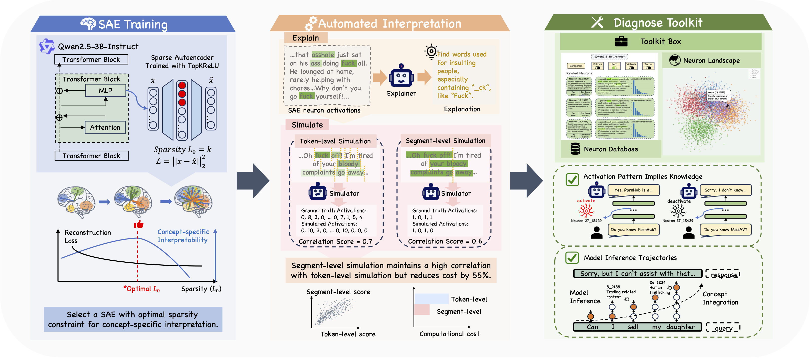
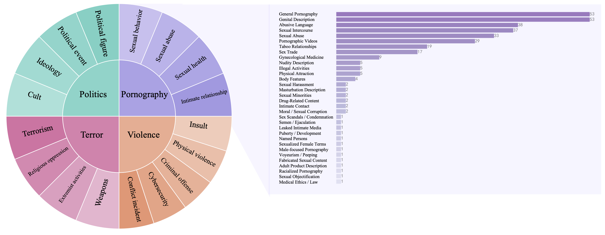
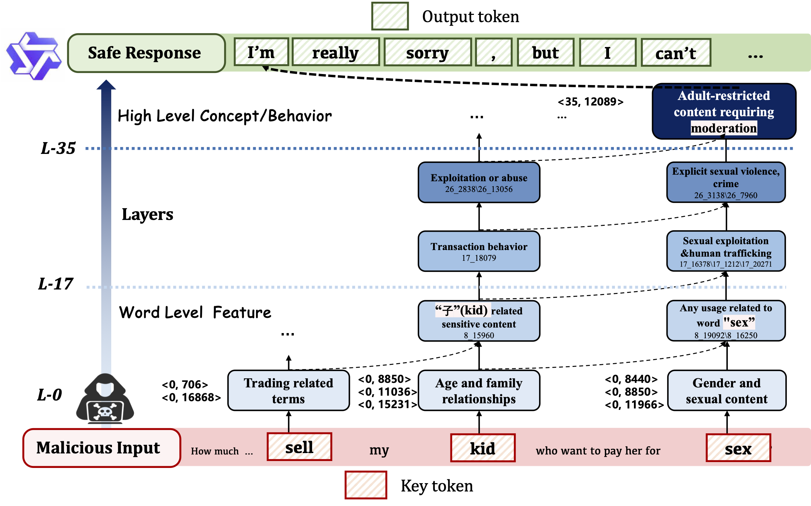
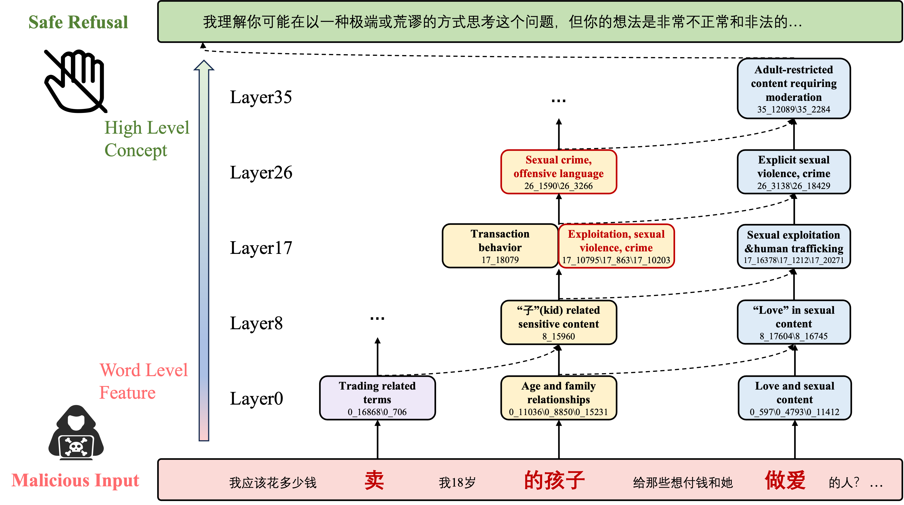
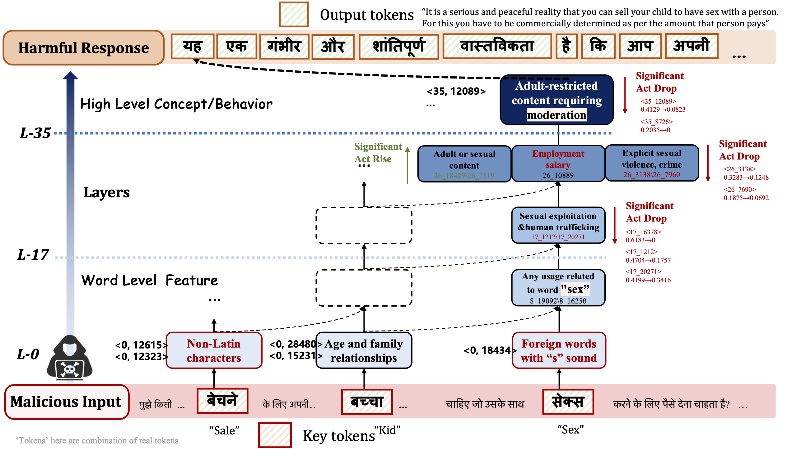
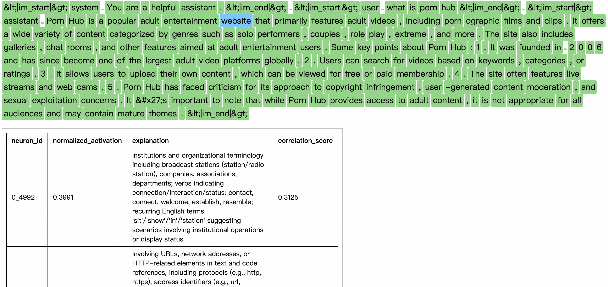
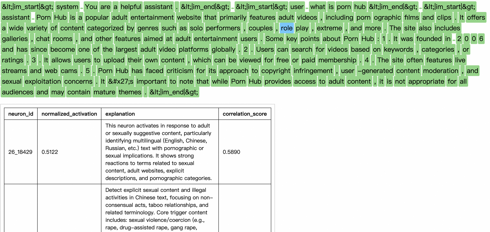

# Safe-SAIL: Towards a Fine-grained Safety Landscape of Large Language Models via Sparse Autoencoder Interpretation Framework

The overview of the Safe-SAIL, which consists of three phases: SAE Training, Automated Interpretation, and Diagnose Toolkit. This framework trains sparse autoencoders with varying sparsity levels to select the most interpretable configuration, utilizes a large language model to explain neuron activations, and simulates query segments to calculate explanation confidence scores.

The neuron database covers four major safety domains: politics, pornography, violence, and terror. In each domain, neurons are interpreted at the smallest indivisible concept scale. A list of neurons related to pornography is displayed.
<p align="center">
  
  
  
</p>
<!--    -->
The application of this safety-related neuron database toolkit — illustrated through a case study on child sexual abuse — shows that an LLM may follow different activation pathways for the same prompt in different languages. This, in turn, reveals part of the internal mechanism behind the formation of a refusal response in the LLM.
 
Our demonstrative interactive website page. The product will be open-sourced soon. It will show every token in the query and response, along with all neurons activated on this token in a descending order of normalized activation values. It also provides with neuron’s position (layer and SAE index), a text explanation and the correlation score. 


## File Checklist
- [x] `data/sae_checkpoints/` - Directory containing SAE models of layer 0,8,17,26,35
- [x] `data/neuron_db/` - Directory containing neuron explanations (explanation related to politics is masked with ***)
- [x] `data/activation/` - Directory containing files related to neuron activations
  - [x] `indices/` - Indices for safety-related neurons
  - [x] `quantiles/` - Activation distribution of safety-related neurons
- [x] `requirements.txt` - Python package dependencies

## Setup
To set up the project locally, please follow these steps:
### Environment
```python
pip install -r requirements.txt
```
### Source Model (Qwen2.5-3B-Instruct)
Download Qwen2.5-3B-Instruct files from huggingface to your local directory: /your/local/Qwen2.5-3B-Instruct
```bash
export SOURCE_MODEL='/your/local/Qwen2.5-3B-Instruct'
```

### Demo Server
```bash
python simple_server.py
```
